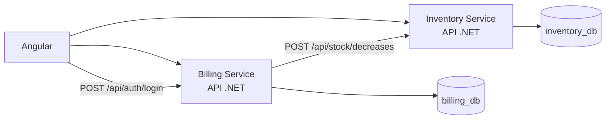

# Sistema de faturamento e estoque

Aplicação de exemplo para cadastro de produtos, criação de notas fiscais e baixa de estoque no momento da impressão. A solução é formada por duas APIs independentes e uma interface web Angular, com bancos de dados separados por contexto.

## Escopo do desafio

- **Produtos:** cadastro com codigo, nome/descricao e saldo disponivel; o produto deve existir antes de ser usado em uma nota fiscal.
- **Notas fiscais:** criacao com numeracao sequencial, status `Aberta`/`Fechada` e multiplos produtos com suas respectivas quantidades.
- **Impressao:** visualizacao em tela, indicador de processamento, baixa do estoque e alteracao do status para `Fechada`; notas que nao estao abertas nao podem ser impressas.
- **Estoque:** atualizacao da quantidade disponivel conforme os itens efetivamente utilizados na nota.
- **Arquitetura:** dois microsservicos independentes (Estoque e Faturamento), cada um com banco relacional proprio e integracao HTTP entre contextos.
- **Falhas:** erros de comunicacao sao tratados e retornados ao usuario com feedback; a impressao e idempotente para evitar baixas duplicadas.

## Decisoes tecnicas registradas

- O front-end usa Angular, componentes, formularios reativos, servicos HTTP e RxJS. Os ciclos de vida sao usados para carregar dados e liberar assinaturas.
- O back-end e dividido em microsservicos .NET com camadas de dominio, aplicacao, infraestrutura e API. PostgreSQL e usado como banco real em desenvolvimento via Docker Compose.
- Bibliotecas, frameworks, persistencia, comunicacao, tratamento de erros e idempotencia estao descritos nas secoes abaixo de tecnologias, arquitetura e fluxo de impressao.

## Funcionalidades

- Cadastro e consulta de produtos, com código único e saldo disponível.
- Criação e consulta de notas fiscais com um ou mais itens.
- Preservação do código e da descrição do produto como *snapshot* no item da nota.
- Impressão de uma nota aberta, com baixa de estoque e encerramento da nota.
- Prevenção de duplicidade nas operações de impressão e de baixa de estoque por chave de idempotência.
- Registro das tentativas de impressão e das movimentações de estoque para auditoria.
- Interface web para as operações principais.
- Autenticação com JWT emitido pelo Billing Service e validado pelos dois microsserviços.
- Criação de novos usuários restrita ao papel `Admin`.

## Arquitetura

Cada API segue uma organização em quatro camadas:

| Camada | Responsabilidade |
|---|---|
| `Domain` | Entidades, estados, invariantes e exceções de negócio. |
| `Application` | Casos de uso e portas (interfaces) para persistência e integrações. |
| `Infrastructure` | Entity Framework Core, PostgreSQL, repositórios, transações e cliente HTTP. |
| `Api` | Controladores HTTP, contratos de entrada/saída e composição de dependências. |

Os contextos são isolados: o **Inventory Service** é responsável por produtos e estoque; o **Billing Service** é responsável por notas e operações de impressão. A comunicação entre eles é HTTP e parte do serviço de faturamento.



Os diagramas detalhados estão em [casos de uso](docs/diagrams/use-cases.md) e [modelo de domínio](docs/diagrams/class-diagram.md).

## Fluxo de impressão

1. A nota é criada com status `Open` e ao menos um item.
2. A requisição de impressão recebe uma `idempotencyKey`.
3. O serviço de faturamento cria ou recupera a operação de impressão e solicita a baixa ao serviço de estoque.
4. O serviço de estoque executa a baixa em transação, registra uma movimentação para cada item e associa todas à chave da operação.
5. Com a baixa confirmada, a nota é fechada e a operação de impressão passa a `Completed`.

Se o estoque não aceitar a baixa ou o serviço estiver indisponível, a nota permanece aberta e a operação é marcada como `Failed`, permitindo nova tentativa. Uma repetição com a mesma chave e os mesmos itens não reduz o saldo outra vez. O uso da mesma chave com itens diferentes retorna conflito.

> A integração é consistente em cada serviço, porém não há transação distribuída entre os dois bancos. Em produção, evoluções como *outbox*, fila e reconciliação devem ser consideradas para tolerância a falhas entre a baixa de estoque e o fechamento da nota.

## Tecnologias

- .NET 10, ASP.NET Core e Entity Framework Core.
- PostgreSQL 17.
- Angular 22, TypeScript e RxJS.
- Docker Compose para os bancos locais.
- xUnit para testes de domínio.

## Pré-requisitos

- [.NET SDK 10](https://dotnet.microsoft.com/download)
- Node.js compatível com npm 11
- Docker Desktop ou um PostgreSQL acessível

## Execução local

### 1. Inicie os bancos

```powershell
docker compose up -d
```

O compose cria os bancos locais abaixo:

| Serviço | Porta local | Banco |
|---|---:|---|
| PostgreSQL de estoque | `5433` | `inventory_db` |
| PostgreSQL de faturamento | `5434` | `billing_db` |

As credenciais de desenvolvimento estão em `docker-compose.yml` e nos arquivos `appsettings.Development.json`. Elas são somente para ambiente local; em outros ambientes, forneça strings de conexão e URLs por configuração segura.

### 2. Inicie as APIs

Em terminais separados:

```powershell
dotnet run --project src/InventoryService/InventoryService.Api
dotnet run --project src/BillingService/BillingService.Api
```

As APIs ficam disponíveis em `http://localhost:5219` e `http://localhost:5290`, respectivamente. No ambiente `Development`, os metadados OpenAPI também são expostos pela aplicação.

No ambiente `Development`, o Billing Service cria automaticamente o usuário `admin` com a senha `Admin123!`. O login é feito por `POST /api/auth/login`, e o Angular envia o JWT em todas as chamadas protegidas. Em outros ambientes, configure `Authentication:Jwt:Secret` por variável de ambiente ou secret manager; não reutilize a chave de desenvolvimento.

As migrações estão versionadas nos projetos de infraestrutura. Para aplicá-las manualmente, caso não sejam aplicadas pelo fluxo usado no seu ambiente:

```powershell
dotnet ef database update --project src/InventoryService/InventoryService.Infrastructure --startup-project src/InventoryService/InventoryService.Api
dotnet ef database update --project src/BillingService/BillingService.Infrastructure --startup-project src/BillingService/BillingService.Api
```

### 3. Inicie a interface web

```powershell
cd web
npm install
npm start
```

Abra `http://localhost:4200`. O CORS das APIs já permite essa origem no desenvolvimento.

## Endpoints principais

### Estoque

| Método | Rota | Descrição |
|---|---|---|
| `POST` | `/api/products` | Cria produto. |
| `GET` | `/api/products` | Lista produtos. |
| `GET` | `/api/products/{id}` | Consulta produto. |
| `POST` | `/api/stock/decreases` | Realiza baixa idempotente de estoque. |

Exemplo de cadastro:

```json
{
  "code": "PRD-001",
  "description": "Produto de exemplo",
  "availableQuantity": 10
}
```

Exemplo de baixa:

```json
{
  "operationKey": "invoice:7d1c:print:attempt-1",
  "items": [
    { "productId": "00000000-0000-0000-0000-000000000000", "quantity": 2 }
  ]
}
```

### Faturamento

| Método | Rota | Descrição |
|---|---|---|
| `POST` | `/api/invoices` | Cria nota fiscal. |
| `GET` | `/api/invoices` | Lista notas. |
| `GET` | `/api/invoices/{id}` | Consulta nota. |
| `POST` | `/api/invoices/{id}/cancel` | Cancela uma nota aberta, preservando-a no histórico. |
| `POST` | `/api/invoices/{id}/print` | Imprime e finaliza uma nota aberta. |

### Autenticação

| Método | Rota | Descrição |
|---|---|---|
| `POST` | `/api/auth/login` | Valida credenciais e retorna um JWT. |
| `POST` | `/api/users` | Cria usuário; requer JWT com papel `Admin`. |

Exemplo:

```json
{
  "username": "admin",
  "password": "Admin123!"
}
```

O cadastro de usuário aceita os papéis `Admin` e `Operator`, exige senha com pelo menos 8 caracteres e nunca retorna o hash da senha.

Exemplo de criação:

```json
{
  "items": [
    {
      "productId": "00000000-0000-0000-0000-000000000000",
      "productCode": "PRD-001",
      "productDescription": "Produto de exemplo",
      "quantity": 2
    }
  ]
}
```

Exemplo de impressão:

```json
{ "idempotencyKey": "request-5ea4c" }
```

Respostas de validação utilizam `ProblemDetails`. Conflitos de regra de negócio, como código já cadastrado, saldo insuficiente, chave incompatível ou nota já fechada, retornam `409`. Indisponibilidade do serviço de estoque durante a impressão retorna `503`.

## Testes e validação

Execute os testes de domínio com:

```powershell
dotnet test tests/BillingService.Domain.Tests
dotnet test tests/InventoryService.Domain.Tests
```

Para validar a interface:

```powershell
cd web
npm test
npm run build
```

Os testes atuais cobrem invariantes centrais: criação e fechamento de notas, inclusão de itens, redução de estoque, rejeição de saldo insuficiente e quantidades inválidas.

## Estrutura do repositório

```text
src/
  BillingService/       # Contexto de faturamento
  InventoryService/     # Contexto de estoque
tests/                  # Testes de domínio
web/                    # Aplicação Angular
docs/diagrams/          # Diagramas de casos de uso e domínio
docker-compose.yml      # PostgreSQL local para cada contexto
```

## Comportamento responsivo

A interface Angular se adapta a telas menores sem exigir uma versão separada:

- Abaixo de `920px`, os cards passam para duas colunas e os painéis de dashboard/formulário passam a uma coluna.
- Abaixo de `640px`, a barra lateral é compactada, o conteúdo recebe margem para não ficar sob a navegação, os cards ficam em uma coluna e formulários/tabelas ocupam a largura disponível.
- Tabelas mantêm rolagem horizontal quando as colunas não cabem na viewport.
- A tela de login reduz o padding e a largura do cartão para uso em celulares.

Para validar os breakpoints, execute `npm start` dentro de `web` e redimensione o navegador para aproximadamente `640px` e `920px` de largura.
