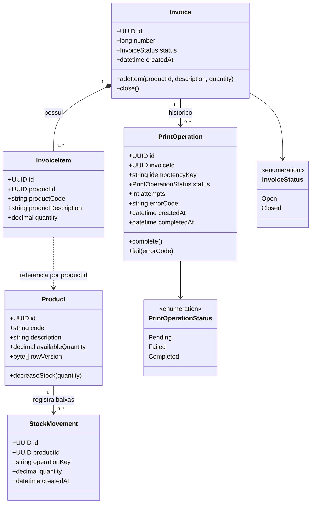

# Diagrama de Classes do Dominio

O modelo separa os contextos de Estoque e Faturamento. `StockMovement` e `PrintOperation` existem para garantir auditoria, recuperacao de falhas e idempotencia no fluxo de impressao.

## Fronteiras de persistencia

| Microsservico | Classes persistidas |
|---|---|
| Inventory Service | `Product`, `StockMovement` |
| Billing Service | `Invoice`, `InvoiceItem`, `PrintOperation` |

`InvoiceItem` guarda codigo e descricao como snapshot para que a nota mantenha seu historico mesmo se o produto for alterado posteriormente.
