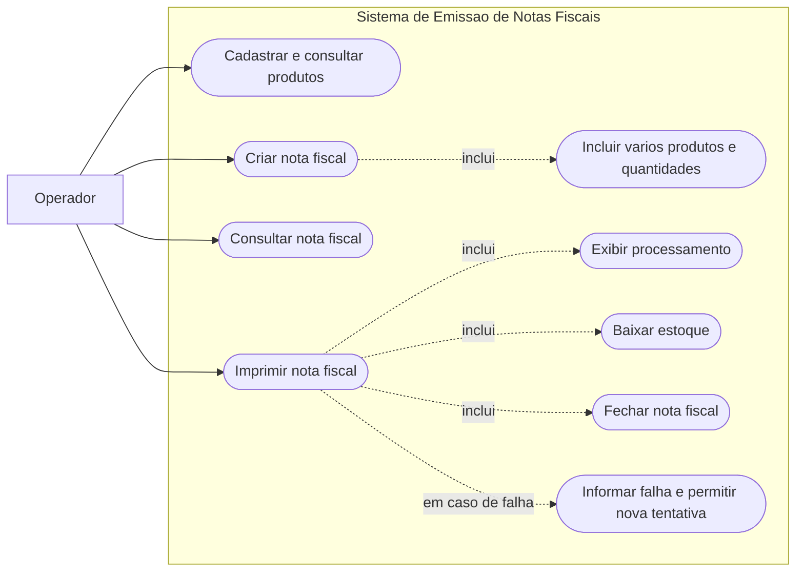

# Diagrama de Casos de Uso

Este diagrama define o limite funcional da primeira versao do sistema de emissao de notas fiscais. O ator `Operador` representa o usuario interno responsavel por cadastro, faturamento e impressao.

## Regras representadas

- A nota nasce com status `Open` e deve conter ao menos um item.
- A impressao so e permitida para nota aberta.
- A baixa de estoque e o fechamento so acontecem quando a operacao de impressao termina com sucesso.
- Falha no servico de estoque preserva a nota aberta, mostra feedback ao operador e permite uma repeticao idempotente.

